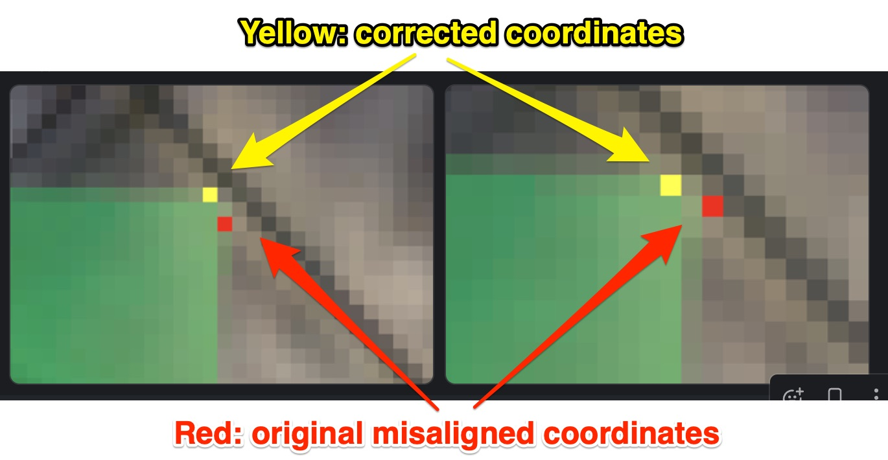

# Homography-based Method to Compute Green Screen Coordinates

The Python program [gs_homography.py](gs_homography.py) computes the coordinates of the 4 corners of the green screen on each video frame in the videos of the [multi-object tracking scenario in Armory](https://github.com/twosixlabs/armory/blob/v0.15.2/armory/data/adversarial/carla_video_tracking_dev.py), **assuming accurate green screen coordinates are present on the first frame of the video**. We develop this program because we have observed that the existing green screen coordinates are not stationary in the virtual world of some video frames, leading the green screen (or patch that would be placed on the green screen) to "move."

The program copies the original videos from a user-provided path (i.e., the "old" dataset), to a new location at a path provided the user (we call this the "new" dataset), and computes the green screen coordinates in the new dataset as calculated according to the parameters provided in [homography.json](homography.json). The program also generates a visualization that show the green screen coordinates of the old data as red dots and new data as yellow dots. The video frames with the visualized coordinates are stored at the same path as the new dataset. Below we show an example of how the coordinates may be corrected by the program ("before" in red vs "after" in yellow).



## How to run the program

```bash
python3 gs_homography.py {json file}
```

## Results

The green screen coordinates in the "new_data" path will be modified

The older and newer coordinates can be compared by the images in the "rgb_w_coords" folder in each video in the new dataset. By default the old coordinates are colored red , and the new coordinates are colored yellow.


